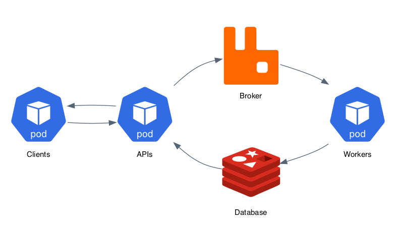

# FastAPI + Celery for ML Inference


This repo is a Proof of Concept (PoC) to build a machine learning inference system using Python and the FastAPI and Celery frameworks.

The idea is to have a client, that can be a frontend or backend app, making requests to an API which will extract insights from audio data. The process will be asynchronous using a task queue from Celery to have workers dealing with the inference process.

The diagram below illustrates the idea deployed on Kubernetes pods and using RabbitMQ as the broker and Redis as the database.



To generate the diagram above, run: `pipenv run diagram`.

---

## Components

### Worker

The Celery workers are responsible for consuming the task queue and store the results into the database. Using Redis as the database, the results will be stored using the `task id` as key and the `task return` as value.

The workers can subscribe to specific queues and can execute different types of tasks.

### API

The `API` has two endpoints: one for post the tasks and one to get the results.

The **post** endpoint `/audio/length` receives in the request body a URL containing an audio file to be analyzed. In this case, it will just get the audio length in seconds. The endpoint sends a task to the queue and returns a `task id` to the client with Http code response 201 (`HTTP_201_CREATED`).

The **get** endpoint `/task` receives a parameter with the `task id` and returns the task status and results (when it's finished successfully). An API client needs to implement a strategy to retrieve the results from the API.

The tasks have, basically, three statuses: `PENDING`, `FAILURE`, and `SUCCESS`.

### Client

The `client` is a system that wants to extract features or insights from audio data and, for that, needs to call an API and send a URL with the audio file.

For the PoC, the `client` has a list of files retrieved from the [The Open Speech Repository](http://www.voiptroubleshooter.com/open_speech/). The American English files are enumerated from 10 to 61 in a no sequential way. The `client` component has a sequential list from 10 to 65, which will make some URLs to fail since the file does not exist.

After the `client` make the request with the URL, the API will send a `task id` which needs to be retrieved from the API with a pulling strategy.

## External Dependencies

### Broker

RabbitMQ serves as a broker for the Celery framework where the tasks are registered, and the workers consume the queue. On the Celery website, you can find more about broker usage for Celery.

### Database

Redis will store the result of each task where the key is the task ID, and the value is the result itself. The result schema will depend on how the task returns the output.

---

## Running the Components with pipenv

You need `pipenv` and Python 3.7 to run locally on your machine. Before start run `pipenv sync` to install all packages.

Before running all the components, you will need services to be a broker and database. If needed, config the environment variables below to connect to existing RabbitMQ and Redis. There are instructions below to run both from docker images.

You need to execute the commands below to start the API and Worker:

```bash
pipenv run celery -A worker.worker worker --loglevel=INFO
pipenv run uvicorn api.api:api --reload
```

And to run the client execute:

```bash
pipenv run python client/client.py
```

### Local broker and database with docker

The RabbitMQ server launched with the command bellow has a management UI where you can check for configs and monitoring usage of cluster. After run the command go to <http://localhost:8080>.

```bash
docker run -d --rm --hostname celery-rabbit --name celery-broker -p 8080:15672 -p 5672:5672 rabbitmq:3.8.2-management-alpine
```

To launch the Redis database, execute the command below.

```bash
docker run -d --rm --hostname celery-redis --name celery-database -p 6379:6379 redis:5.0.7
```

### Environment variables

| Variable          | Description |
| ---               | --- |
| REDIS_HOST        | Redis host address
| REDIS_PORT        | Redis host port
| REDIS_USER        | Redis username
| REDIS_PASS        | Redis password
| REDIS_DB          | Redis database number
| RABBITMQ_HOST     | RabbitMQ host address
| RABBITMQ_PORT     | RabbitMQ Host port
| RABBITMQ_USER     | RabbitMQ username
| RABBITMQ_PASS     | RabbitMQ password
| RABBITMQ_VHOST    | RabbitMQ virtual host

---

### Running all Services with Docker

The docker-compose has all the services configured, and there is no need to have a Redis or RabbitMQ instances already configured.

To launch all services, you need to run:

```bash
docker-compose run client
```

Be aware that there is no control over the startup process, so you can find yourself sending requests to an API or worker not ready.

## Workers for Machine Learning Inference

The possibilities with Celery workers as a machine learning inference system are promising. Workers can be hosted on any k8s pod and take advantage on autoscaling approaches, or cloud instances (like AWS EC2) and have hardware settings customized to the model needs (deep learning could benefit from GPUs).

With a more complex broker, like RabbitMQ, workers can subscribe to specific queues, which will give the possibility to deal with several different problems using almost the same infrastructure. The API component can serve as a gateway to all models, or multiple APIs could publish tasks into the broker where each worker group (workers subscribed to the same queue) can share the load.

Having all components running on different docker files shows the path to have separate git repos for workers and APIs, which make it simpler to automate the deploy of each component. The only thing that the API and the Worker share are the task's name and credentials to broker and database, but this will be a configured using environment variables.

## Next Steps

- Add a simple ML model for gender identification from audio data.
- Add different workers subscribed to different queues.
- Add the option to send a callback URL to send the response when ready, to be an alternative to pull the response from the API.
